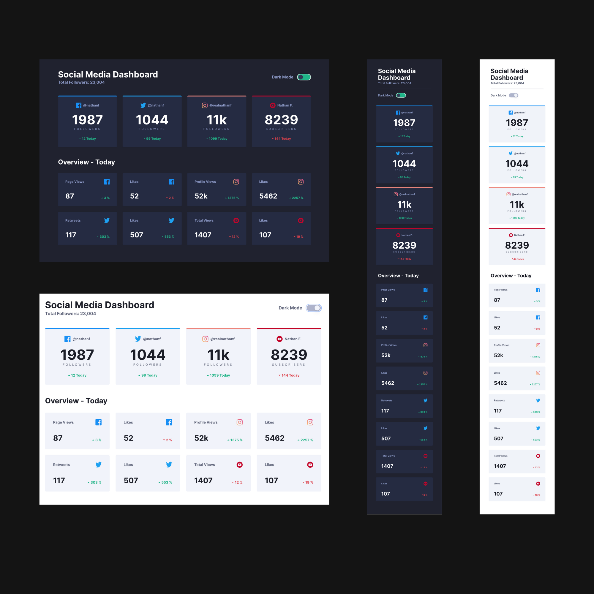

# Frontend Mentor - Social media dashboard with theme switcher solution

This is a solution to the [Social media dashboard with theme switcher challenge on Frontend Mentor](https://www.frontendmentor.io/challenges/social-media-dashboard-with-theme-switcher-6oY8ozp_H).

## Table of contents

- [Overview](#overview)
  - [The challenge](#the-challenge)
  - [Screenshot](#screenshot)
  - [Links](#links)
- [My process](#my-process)
  - [Built with](#built-with)
  - [How I built it](#how-i-built-it)
  - [What I learned](#what-i-learned)
  - [Continued development](#continued-development)

## Overview

### The challenge

Users should be able to:

- View the optimal layout for the site depending on their device's screen size
- See hover states for all interactive elements on the page
- Toggle color theme to their preference

### Screenshot

### Links

- Live Site URL: (https://rococo-tanuki-76abba.netlify.app/)

## My process

### Built with

- Vite
- Typescript
- React
- Tailwind
- Headless UI

### How I built it

Even though this is a front-end only project, I wanted to approach the project as if the dashboard was drawing numbers from a database rather than hardcoding the stats. I added all of the data to a sampleData.tsx, and then imported them into App.tsx. I used React components for each type of widget, and passed in all of the stats and variables as props.

A lot of elements are dynamic on the widget as well: the text will automatically change from green to red if the numbers are negative, and it will remove the negative sign as well. The arrow will change from a green up arrow to a downwards red arrow using the same logic. Also if the number is above 10,000, it will automaticaly change it from 11,000 to 11k.

The dark theme was a bit tricky, but I was able to incorporate it by storing the selected mode in state and updating it whenver the toggle was switched. Finding a toggle that worked took some work. I originally used one from DaisyUI but ran into too many bugs styling it, so I switched to HeadlessUI. I hadn't even heard of HeadlessUI before, but it worked perfectly and not only is a lot more customizable than Daisy, it offers excellent accessibility right out of the box.

As for responsive design, I'm pretty proud of how I was able to make it look polished on all screen sizes. I didn't like the way it looked using flex-wrap since you had a row of 3 and then 1, so I refactored to use grid in order to make sure you only had rows of 4 or 2 (or 1 on mobile). I also adjusted the size of the widgets on mobile to make sure it was utilizing the full width of the device.

### What I learned

I think the biggest mistake I made early on with this project is creating two separate widgets for the followers and the metrics.

What I should have done is create a single parent widget type that contained basic attributes like background, hover states, and responsive stylings, and then passed in a "type" prop where I defined the different layouts for each widget. I ended up duplicating a lot of code between the two widgets that I didn't have to.

I should have also created a component for "widgetRow" that handled all the reponsive stylings instead of coding each section manually in App.tsx.

Finally, with darkMode, I think I should have used Tailwind's method of implementing dark mode, which sets a class on the HTML document itself rather than storing it in the app as state. My solution ended up working fine, but it doesn't automatically detect the light/dark mode preference on the user's computer right out of the box.

### Continued development

The one thing I was not able to figure out was how to do the gradients on the toggle switch or the Instagram follower widget border. Hopefully I can return and try to knock those out again because they look beautiful on the design.

I also did not incorporate the slightly different color bar on the top quarter of the page into my initial markup, and it will require some refactoring to add it in.
